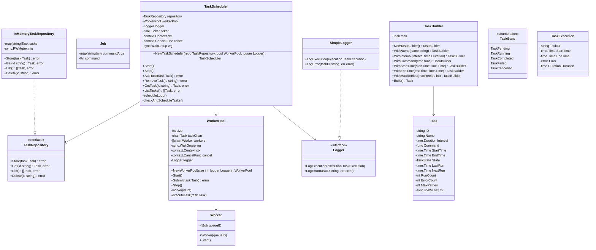

```mermaid
classDiagram
direction TB
    class TaskScheduler {
	    -TaskRepository repository
	    -WorkerPool workerPool
	    -Logger logger
	    -time.Ticker ticker
	    -context.Context ctx
	    -context.CancelFunc cancel
	    -sync.WaitGroup wg
	    +NewTaskScheduler(repo TaskRepository, pool WorkerPool, logger Logger) TaskScheduler
	    +Start()
	    +Stop()
	    +AddTask(task Task) error
	    +RemoveTask(id string) error
	    +GetTask(id string) Task, error
	    +ListTasks() []Task, error
	    -scheduleLoop()
	    -checkAndScheduleTasks()
    }

    class TaskRepository {
	    +Store(task Task) error
	    +Get(id string) Task, error
	    +List() []Task, error
	    +Delete(id string) error
    }

    class WorkerPool {
	    -int size
	    -chan Task taskChan
	    -[]chan Worker workers
	    -sync.WaitGroup wg
	    -context.Context ctx
	    -context.CancelFunc cancel
	    -Logger logger
	    +NewWorkerPool(size int, logger Logger) WorkerPool
	    +Start()
	    +Submit(task Task) error
	    +Stop()
	    -worker(id int)
	    -executeTask(task Task)
    }

    class Logger {
	    +LogExecution(execution TaskExecution)
	    +LogError(taskID string, err error)
    }

    class Job {
        -map[string]any commandArgs
        -Fn command
    }

    class TaskBuilder {
	    -Task task
	    +NewTaskBuilder() TaskBuilder
	    +WithName(name string) TaskBuilder
	    +WithInterval(interval time.Duration) TaskBuilder
	    +WithCommand(cmd func) TaskBuilder
	    +WithStartTime(startTime time.Time) TaskBuilder
	    +WithEndTime(endTime time.Time) TaskBuilder
	    +WithMaxRetries(maxRetries int) TaskBuilder
	    +Build() Task
    }

    class Task {
	    -string ID
	    -string Name
	    -time.Duration Interval
	    -func Command
	    -time.Time StartTime
	    -time.Time EndTime
	    -TaskState State
	    -time.Time LastRun
	    -time.Time NextRun
	    -int RunCount
	    -int ErrorCount
	    -int MaxRetries
	    -sync.RWMutex mu
    }

    class InMemoryTaskRepository {
	    -map[string]Task tasks
	    -sync.RWMutex mu
	    +Store(task Task) error
	    +Get(id string) Task, error
	    +List() []Task, error
	    +Delete(id string) error
    }

    class SimpleLogger {
	    +LogExecution(execution TaskExecution)
	    +LogError(taskID string, err error)
    }

    class TaskState {
	    TaskPending
	    TaskRunning
	    TaskCompleted
	    TaskFailed
	    TaskCancelled
    }

    class TaskExecution {
	    -string TaskID
	    -time.Time StartTime
	    -time.Time EndTime
	    -error Error
	    -time.Duration Duration
    }

	class Worker {
		-[]Job queueID
        +Worker(queueID)
        +Start()
	}

	<<interface>> TaskRepository
	<<interface>> Logger
	<<enumeration>> TaskState

    TaskScheduler --> TaskRepository
    TaskScheduler --> WorkerPool
    TaskScheduler --> Logger
    WorkerPool --> Worker
    TaskBuilder --> Task
    InMemoryTaskRepository ..|> TaskRepository
    SimpleLogger ..|> Logger


```
