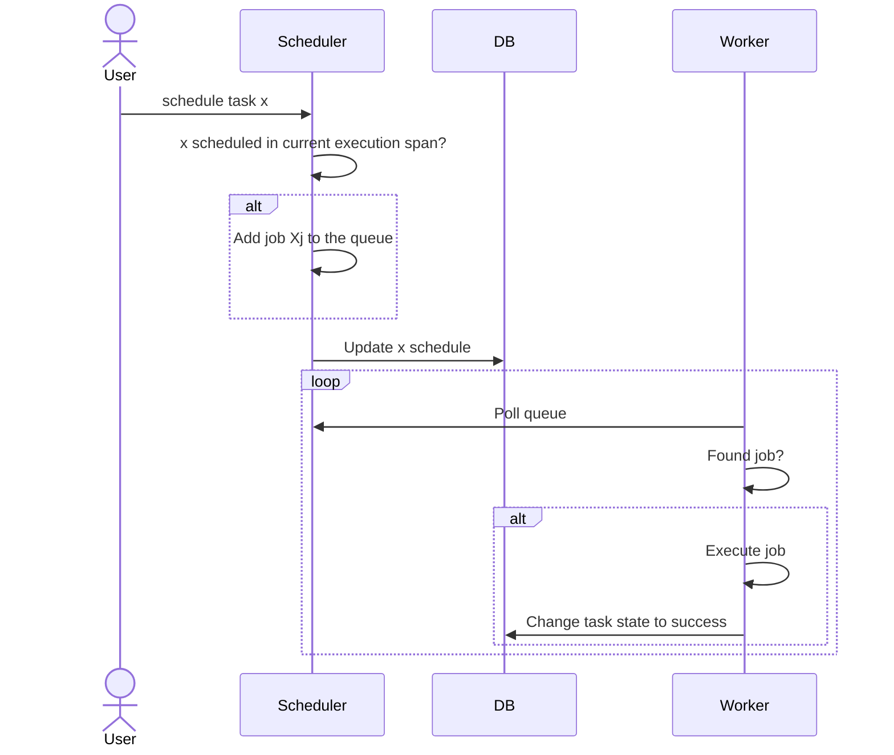

## Schedule task

```mermaid
sequenceDiagram
    actor User
    User ->> Scheduler: schedule task x
    %%workerpool, worker, executor
    Scheduler->>Scheduler: x scheduled in current execution span?
    alt
        Scheduler->>Scheduler: Add job Xj to the queue
    end
    Scheduler->>DB: Update x schedule
    loop
        Worker->>Scheduler: Poll queue
        Worker->>Worker: Found job?
        alt
            Worker->>Worker: Execute job
            Worker->>DB: Change task state to success
        end
    end
    %% loop
    %%     Executor->>Executor: queue not empty?
    %%     alt
    %%         Executor->>WorkerPool: worker available?
    %%         alt
    %%             Executor->>Worker: Add next task to queue
    %%             Worker->>Worker: Execute task
    %%             Worker->>Worker: Save result
    %%             Worker->>Worker: Save result
    %%         end
    %%     end
    %% end
```
